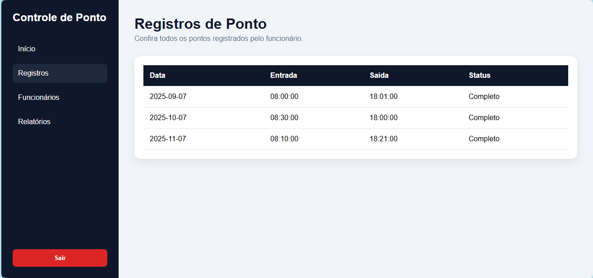

# 🕒 Controle de Ponto

## 📖 Sobre o projeto

O objetivo deste projeto é desenvolver um sistema de controle de ponto para os funcionários de uma empresa.

O sistema permitirá consultar os registros de ponto dos funcionários e, futuramente, poderá permitir que o próprio funcionário registre seus horários de entrada e saída pela aplicação.

> Este projeto está sendo construído como parte do meu processo de aprendizado em desenvolvimento de Web APIs com C# e ASP.NET Core.

---

## 🎯 Funcionalidades planejadas

- Visualizar os registros de ponto de um funcionário;
- Registrar horários de entrada e saída;
- Editar registros de ponto;
- Justificar atrasos, faltas ou registros incorretos;
- Consultar o histórico de registros;
- Identificar registros completos e incompletos;
- Realizar autenticação de usuários;
- Controlar permissões de funcionários e administradores.

---

## 🚧 Status do projeto

O projeto está em desenvolvimento e será construído gradualmente conforme avanço nos estudos.

Algumas funcionalidades ainda não foram implementadas e poderão sofrer alterações durante o processo de aprendizagem.

---

## 💻 Tecnologias

- C#
- ASP.NET Core
- HTML
- CSS
- JavaScript
- Git e GitHub

